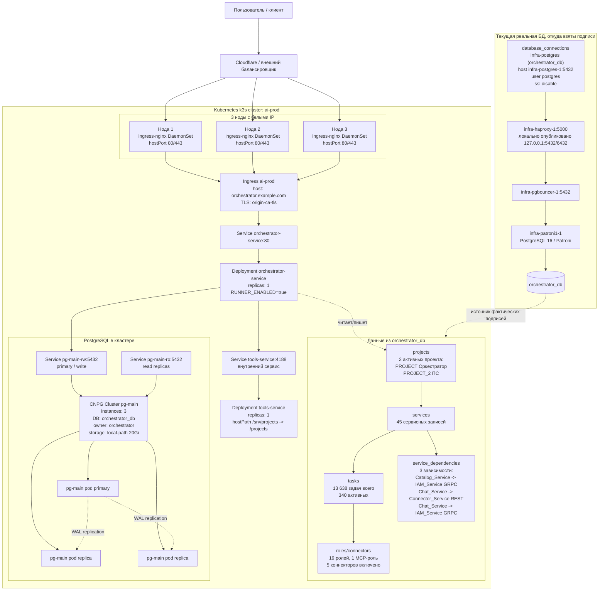

# Схема работы Kubernetes-кластера

Источник данных: `orchestrator_db`, снято из реальной БД 2026-07-08 через контейнер `infra-patroni1-1`.

Важное ограничение: в БД нет отдельных таблиц Kubernetes-объектов (`Ingress`, `Service`, `Pod`, `Node`). Поэтому внешний контур кластера взят из текущих k8s-манифестов `deploy/k8s`, а сервисный слой, проекты, зависимости, роли, задачи и подключение к БД подписаны фактическими строками из `orchestrator_db`.

## Факты из БД

| Область | Факт |
| --- | --- |
| Проекты | `PROJECT` (`Оркестратор`), `PROJECT_2` (`ПС`), оба `active` |
| Root paths | `F:\git\ai-dev-manager`, `F:\git\PS` |
| Подключение к БД | `infra-postgres (orchestrator_db)` -> `infra-postgres-1:5432/orchestrator_db`, `ssl_mode=disable` |
| Сервисы | 45 записей в `services` |
| Задачи | `PROJECT`: 2912 всего / 154 активных; `PROJECT_2`: 10726 всего / 186 активных |
| Роли и коннекторы | 19 ролей, 1 MCP-роль, 5 включенных коннекторов |
| Deployments в БД | 0 записей |

## Самые активные сервисы по задачам

| Проект | Сервис | Активные | Всего |
| --- | --- | ---: | ---: |
| `PROJECT` | `orchestrator-service` | 7 | 103 |
| `PROJECT` | `host-runner` | 2 | 12 |
| `PROJECT_2` | `catalog_service` | 2 | 11 |
| `PROJECT_2` | `front_salesflow` | 2 | 6 |
| `PROJECT` | `PIPELINE_RUNNER` | 1 | 5 |
| `PROJECT` | `pipeline-runner` | 1 | 4 |
| `PROJECT_2` | `Mail/Mail_Service` | 1 | 4 |

## Поток запроса

1. Пользователь приходит на Cloudflare / внешний балансировщик.
2. Балансировщик отправляет HTTPS на белый IP любой из трех нод.
3. На каждой ноде слушает `ingress-nginx` как DaemonSet через `hostPort 80/443`.
4. `Ingress ai-prod` по host `orchestrator.example.com` ведет на `Service orchestrator-service:80`.
5. `orchestrator-service` работает в одном pod и обращается к:
   - `tools-service:4188` внутри кластера;
   - `pg-main-rw:5432` для записи в PostgreSQL;
   - таблицам `projects`, `services`, `tasks`, `roles`, `connectors` внутри `orchestrator_db`.
6. PostgreSQL в k8s описан как CNPG `pg-main` из 3 экземпляров: primary + 2 streaming replicas.
